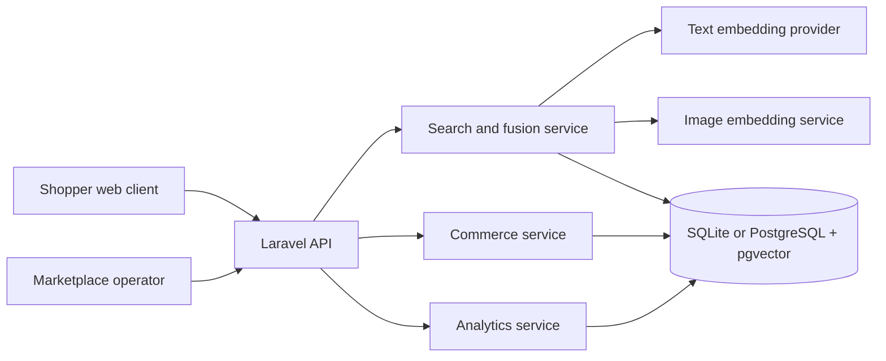

# KonnectFind Architecture

## Research Objective

KonnectFind investigates whether multimodal, meaning-first retrieval can reduce
the vocabulary mismatch between Nigerian shoppers and conventional catalogue
search. The system accepts conversational text, product imagery, or both, then
ranks products across a multi-vendor marketplace.

## Principal Contributions

1. A Nigerian-context conversational retrieval pipeline with local-language
   shopping expressions and query expansion.
2. Multimodal retrieval that combines text and image evidence using reciprocal
   rank fusion.
3. A mobile-first, full-screen discovery feed designed to make ranked results
   engaging rather than merely functional.
4. A complete multi-vendor commerce flow with server-authoritative pricing,
   stock validation, atomic inventory deduction, and marketplace analytics.
5. A reproducible synthetic catalogue generator containing 500 vendors and
   250,000 Nigerian-context products.

## System Context

## Retrieval Pipeline

1. The query is normalized and tokenized.
2. Nigerian-context synonyms expand terms such as `owambe`, `pikin`, and
   `heavy-duty`.
3. Text and image representations are generated independently.
4. Candidate products are retrieved from active vendors and inventory.
5. Text retrieval combines lexical overlap, merchandising terms, and vector
   similarity.
6. Combined searches use reciprocal rank fusion to merge text and image ranks.
7. Search results, ranks, clicks, and zero-result queries are logged for
   evaluation and catalogue-gap analysis.

## Commerce Integrity

- Prices are always read from the server during checkout.
- Products are locked during order creation to prevent overselling.
- Inventory deduction and order creation occur in one database transaction.
- Order items preserve product, vendor, SKU, quantity, and price snapshots.
- Payment statuses remain pending until a real payment provider confirms them.

## Scalability Strategy

Local development uses SQLite and deterministic embeddings for reproducibility.
Production uses PostgreSQL with pgvector HNSW indexes. The 250,000-product JSON
importer reads one record at a time and writes in batches, avoiding whole-file
memory loading.

## Security And Privacy Boundaries

The prototype validates uploaded images, request sizes, checkout fields,
product availability, and order quantities. It does not store card details.
Authentication, authorization, fraud detection, payment webhooks, and personal
data retention policies are explicitly future production work.
